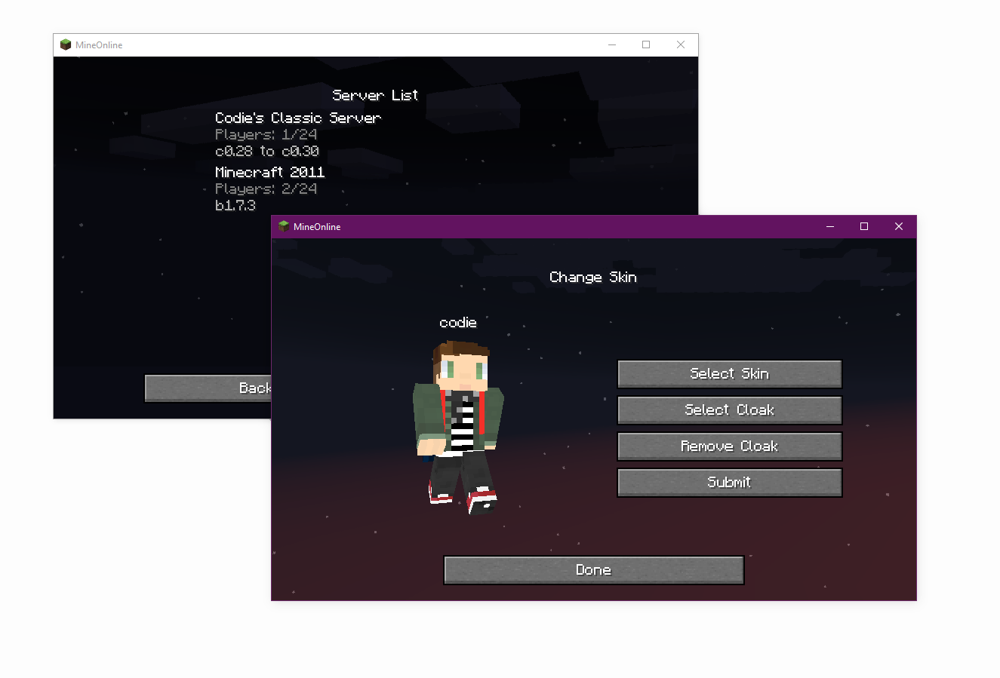

# Development Update
As I enter my final year of University I will be taking a break from this project.
Everything will remain online and I will do my best to ensure things keep running smoothly, but I will be unable to tackle big changes until June 2021.
If you find this project interesting, and know your way around Java, please consider supporting helping me get through the issues :)
See the "For Developers" section below.
These days, I'm not the only person working on this, so progress will continue, slowly.
- Codie


Launch old versions of minecraft just as you remembered them.

## What is MineOnline?
MineOnline is a launcher Minecraft capable of running web applets without a browser, and redirecting web requests to a new API.

For example, if you wanted to play classic right now, you'd have no way to launch it without a lot of outdated vulnerable software and luck. And even if you pulled it off, you'd be running a stipped down version of the game, with no skins, no server authentication and no online map saving. MineOnline fixes this.

The program can also run regular desktop versions of the game, and even old launchers.

**Compatible with Java 8u101+**

[Download](https://github.com/codieradical/MineOnline/releases)

( also available on the [Arch User Repository](https://aur.archlinux.org/packages/mineonline/) as maintained by [@maddoxdragon](https://github.com/maddoxdragon/) )

## Features
These are features MineOnline will bring to Minecraft.

- Skins and Cloaks

- Resource Files (Sounds, the right ones for each version!)

- [Server List](https://mineonline.codie.gg/servers)

- Online World Saves
  - You can also upload classic maps via the website.
  
- Screenshots (F2)

- FOV Option

- Texture packs for versions before Alpha 1.2.2 (when it was officially added)

- GUI scaling for versions before Beta 1.5 (when it was officially added)

- Launcher Authentication and Updates

- Secure Server Authentication (online-mode and verify-names)

- Resizable & Fullscreenable Applets with Mac and Linux Support

- Bit depth fix (removes jagged lines from clouds and other stuff).

- Full Discord Integration



## Launching Servers
If you'd like to launch a server to authenticate using a different API, you can do so with the following launch command.

`-cp <MineOnline.jar path> gg.codie.mineonline.Server <server jar path> [server main class] [server arguments]`

For example, the typical launch command

```java  -Xmx1024M -Xms1024M -jar minecraft_server.jar```

becomes

```java -cp MineOnline.jar gg.codie.mineonline.Server minecraft_server.jar -Xmx1024M -Xms1024M```

If you don't want your server to appear on the list, set `public: false` in `server.properties`.

You can optionally provide a "serverlist-ip" and or "serverlist-port" in your server.properties, if you'd like a different IP/port to be listed.

## For Modders
You can add custom version information to the launcher by creating a version info file at `.minecraft\mineonline\custom-versions\`.
The file should be in a directory named client or server, and it's name should contain the version name and md5.
For example:
`.minecraft\mineonline\custom-versions\client\Skylands 0.1 F8F78A4ED4033547CC1EA28C776DA7AE.json`
This file should contain an array of JSON versions, like this:

```json
{ 
  "name": "Skylands 0.1", 
  "md5": "F8F78A4ED4033547CC1EA28C776DA7AE", 
  "type": "client",
  "baseVersion": "b1.7.3",
  "info": "Beta 1.7.3 mod",
  "legacy": true
}
```

Legacy is true for any pre-1.6 minecraft version.
For 1.6 and above, libraries should be provided. Examples can be found [here](https://github.com/codieradical/MineOnline/blob/master/res/versions/client/).

I recommend you start with the unmodded version information as a template, as most of the settings will carry over.

If you would like a version to be added to the main list, contact me (Codie).

## For Developers
If you would like to help out, a good place to start is the ZenHub workspace, all of the issues are managed in [ZenHub](https://app.zenhub.com/workspaces/mineonline-5ec5d0ef84b144f89c5bc5c7). The best place to reach me is in my [discord server](https://discord.gg/xuyT7Xm).

As per the license you are welcome to use the launcher code under non-commercial conditions.

I also request that forks remain up to date for security.
